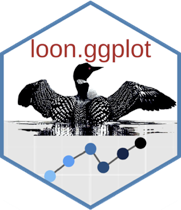
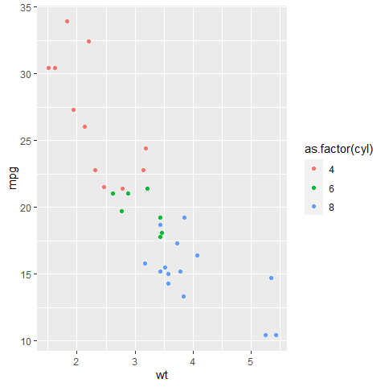
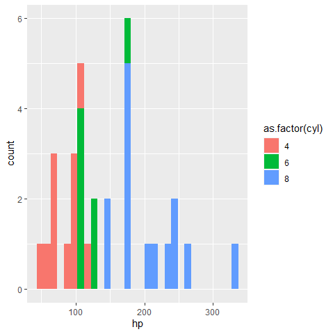
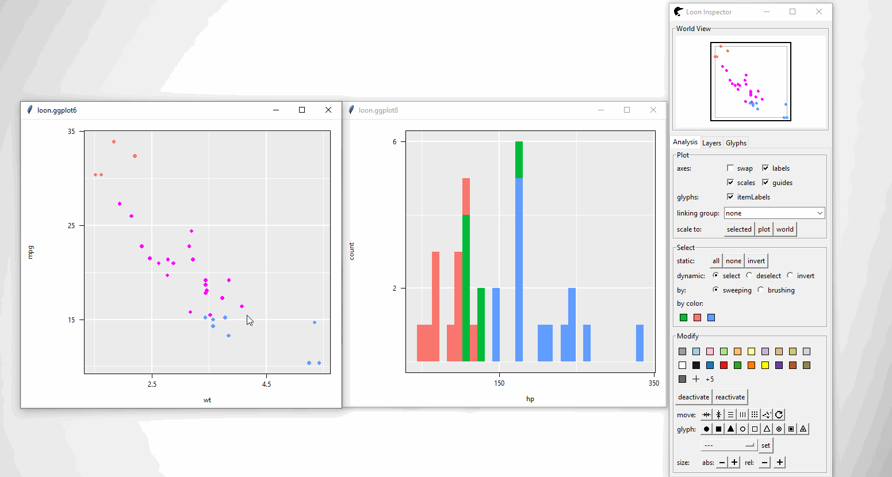
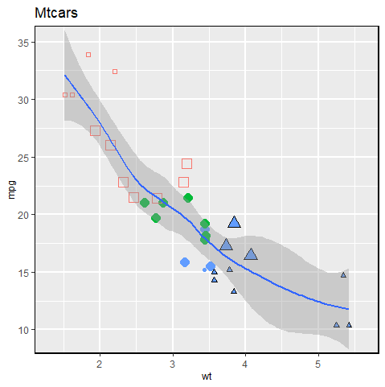
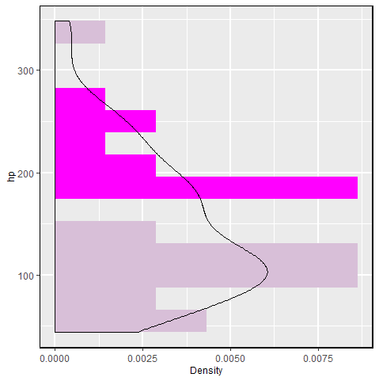
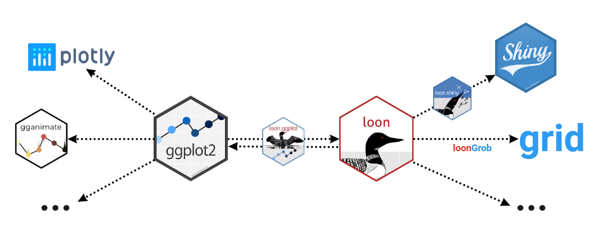
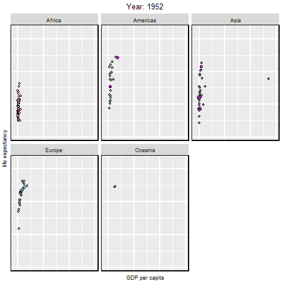
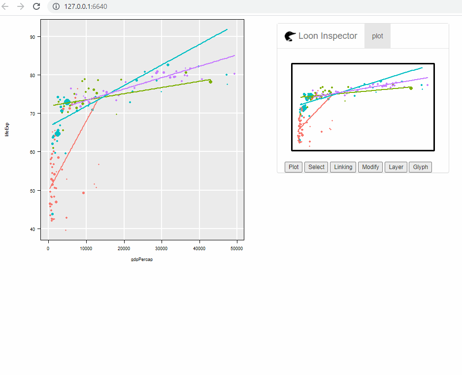

# loon.ggplot  

[](https://travis-ci.com/great-northern-diver/loon.ggplot)
[](https://codecov.io/gh/great-northern-diver/loon.ggplot?branch=master)
[](https://cran.r-project.org/web/packages/loon.ggplot/index.html)
[](https://cran.r-project.org/package=loon.ggplot)

An R package to turn ggplot graphic data structures into interactive loon plots.  Extends the grammar to add interactivity.


Documentation: [https://great-northern-diver.github.io/loon.ggplot/](https://great-northern-diver.github.io/loon.ggplot/)

## Introduction

The `ggplot2` graphics package (part of the `tidyverse` package collection) uses the base `grid` graphics package to produce publication quality graphics for data analysis.  Based on a grammar for graphics, `ggplot2` also provides a lot of functionality (e.g. `facet`s) that can be extremely useful in data analysis.

The `loon` graphics package provides **interactive** graphics especially valuable in any **exploratory data analysis**.  This includes programmatic and direct manipulation of the visualizations to effect interactive identification, zooming, panning, and linking between any number of displays. Of course, `loon` also provides publication quality static graphics in `grid` via loon's functions `grid.loon()` and `loonGrob()`.


The loon.ggplot package brings **both these packages together**. Data analysts who value the ease with which `ggplot2` can create meaningful graphics can now turn these `ggplot`s into interactive `loon` plots for more dynamic interaction with their data.  Conversely,  data analysts who explore data interactively can at any time turn a snapshot of their interactive `loon` plots into `ggplot`s.   The former is accomplished by the simple translation function **`ggplot2loon()`** and the latter by the simple translation function **`loon2ggplot()`**.

## An interactive grammar


`loon.ggplot` extends the grammar of graphic to include interactive clauses:

- `+ linking()`
- `+ hover()`
- `+ selection()`
- `+ active()`
- `+ zoom()`
- `+ interactivity()`

A `ggplot()` created with any of these clauses (in addition to the usual grammar) will `print()` as an interactive `loon` plot and `plot()` as a static ggplot.

## Install from `R`

Just as the `tidyverse` includes `ggplot2`, the package suite called `diveR` includes `loon.ggplot` and many more interactive visualization packages. 

Installing `diveR` from CRAN will include installing `loon.ggplot`:

```
install.packages("diveR")
```

Alternatively, `loon.ggplot` (and its dependencies) may be installed directly

- from `CRAN`

  ```
  install.packages("loon.ggplot")
  ```
  
  or
  
- from `github`

  ```
  remotes::install_github("https://github.com/great-northern-diver/loon.ggplot")
  ```


## Examples

More detail is given in the vignettes, especially `"A Grammar Of Interactive Graphics"` and `"There And Back Again"`.  

Below functions transforming from a ggplot to a loon plot, and from a loon plot to a ggplot, are demonstrated.

### `ggplot2loon()`: ggplot --> loon

* Construct `ggplot`

Consider the `mtcars` data set. Suppose we draw a scatterplot of the mileage `mpg` (miles per US gallon) versus the weight of the car `wt` in thousands of pounds and colour represents different cylinder numbers. In `ggplot2` this would be constructed as

```
library(ggplot2)
p <- ggplot(mtcars, aes(wt, mpg, colour = as.factor(cyl))) + geom_point()
p
```


We might also display a histogram of some other variate, say the engine's horsepower `hp`.  In `ggplot2` this would be constructed as
```
h <- ggplot(mtcars, aes(x = hp, fill = as.factor(cyl))) + geom_histogram()
h
```


* To `loon`

the `"ggplot"` data structures `p` and `h` can be **turned into interactive loon plot**s using the `ggplot2loon()` function:

```
library(loon.ggplot)
pl <- ggplot2loon(p)
hl <- ggplot2loon(h)
```


An alternative way of doing so is to replace `ggplot()` function to `l_ggplot()` function. Then, follow the pipe rules of `ggplot()` but get a `loon` plot.

```{r}
# the scatter plot
l_ggplot(mtcars, aes(wt, 
                     mpg, 
                     colour = as.factor(cyl))) + 
  geom_point()
# the histogram
l_ggplot(mtcars, aes(x = hp, fill = as.factor(cyl))) + 
  geom_histogram()
```

Note that:

  + Loon "Hello World": Introduction to interactive `loon` plots can be found via  [loon](https://cran.r-project.org/web/packages/loon/vignettes/introduction.html). It shows how to create, manipulate (selection, linking and etc) `loon` plots
    
  + `loon.ggplot` talk: A talk "Interactive ggplots in R" has been given in [SDSS 2019](https://ww2.amstat.org/meetings/sdss/2019/onlineprogram/AbstractDetails.cfm?AbstractID=306216). Slides can be found in [SDSS2019/loon.ggplot talk](https://www.math.uwaterloo.ca/~rwoldfor/talks/SDSS2019/loon.ggplot/assets/player/KeynoteDHTMLPlayer.html) which gives more details.
  
  + A `ggmatrix` object in package `GGally` can also be converted to a `loon` widget. See `help(ggplot2loon)` for more info.

### `loon2ggplot()`: loon --> ggplot

After creating `loon` plots and adding programmatic and direct manipulation of the visualizations to effect interactive identification, function `loon2ggplot` can be applied to return a static `ggplot`

```
pg <- loon2ggplot(pl)
hg <- loon2ggplot(hl)
```

Note that `pg` and `hg` are `ggplot` objects. 

```
class(pg)
[1] "gg"     "ggplot"
class(hg)
[1] "gg"     "ggplot"
```

Layers, theme adjustment can be piped though like:

```
pg + 
  ggplot2::geom_smooth() + 
  ggplot2::ggtitle("Mtcars")
```


```
hg + 
  ggplot2::geom_density() + 
  ggplot2::coord_flip()
```


Note that:

  + Compound loon widget like `l_ts` and `l_pairs` are created by [`patchwork`](https://patchwork.data-imaginist.com/index.html). The `ggplot` components like `theme`, `labels` can be piped through but by the `patchwork` rule.
  
  + Some functionalities are provided 
    * Adding glyphs on scatterplot like `geom_serialAxesGlyph()`, `geom_polygonGlyph()`, `geom_imageGlyph()` and etc.
    * Providing serial axes plots (parallel coordinate and radial coordinate) via `ggSerialAxes()`

### `loon.ggplot()`: loon <--> ggplot 

`loon.ggplot()` gathers features of both `loon2ggplot()` and `ggplot2loon()`. It can take either a `loon` widget or `gg` object and transform back and forth.

```
p <- l_plot(iris)
# `loon` to `gg`
g <- loon.ggplot(p)
g <- g + geom_smooth(method = "lm") + theme_bw() 
g
# `gg` to `loon`
l <- loon.ggplot(g)
```

## More than `loon` or `ggplot2`

More than connecting `ggplot2` and `loon` these two specific graphical systems, `loon.ggplot` is able to connect the suite behind them.


### `loon` --> `ggplot2` --> `gganimate`

Return an animation from a `loon` plot

```
# a loon plot
library(gapminder)
p <- with(gapminder, 
          l_plot(gdpPercap, lifeExp,
                 # scale the size into certain amounts
                 size = scales::rescale(pop, to = c(4, 50)),
                 color = continent,
                 itemLabel = as.character(country),
                 showItemLabels = TRUE
          ))
          
# highlight large population countires     
library(dplyr)
top10in2007 <- gapminder %>% 
  filter(year == 2007) %>%
  top_n(10, pop)
p['selected'][gapminder$country %in% top10in2007$country] <- TRUE

# to `ggplot` then to `animation`
library(gganimate)
loon.ggplot(p, selectedOnTop = FALSE) + 
  facet_wrap(gapminder$continent) + 
  theme(legend.position = "none") + 
  labs(title = 'Year: {frame_time}', 
       x = 'GDP per capita', 
       y = 'life expectancy') + 
  transition_time(gapminder$year) +
  ease_aes('linear')
```



### `ggplot2` --> `loon` --> `shiny`

Return a shiny web app from a `ggplot` object

```
library(dplyr)
gp <- gapminder %>% 
  filter(year == 2007,
         continent != "Oceania") %>%
  ggplot(mapping = aes(gdpPercap, lifeExp, 
                       colour = continent)) + 
  geom_point(mapping = aes(size = pop)) + 
  geom_smooth(mapping = aes(weight = pop),
              method = "lm",
              se = FALSE)

library(loon.shiny)
gp %>% 
  loon.ggplot() %>% 
  loon.shiny()
```


