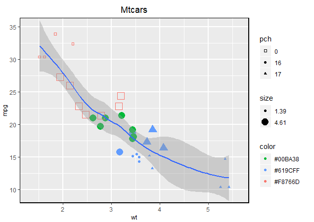

## loon.ggplot  

[](https://travis-ci.org/great-northern-diver/loon.ggplot)
An R package to turn ggplot graphic data structures into interactive loon plots


Documentation: [http://great-northern-diver.github.io/loon.ggplot/](http://great-northern-diver.github.io/loon.ggplot/)

### Introduction

The `ggplot2` graphics package (part of the `tidyverse` package collection) uses the base `grid` graphics package to produce publication quality graphics for data analysis.  Based on a grammar for graphics, `ggplot2` also provides a lot of functionality (e.g. `facet`s) that can be extremely useful in data analysis.

The `loon` graphics package provides **interactive** graphics especially valuable in any **exploratory data analysis**.  This includes programmatic and direct manipulation of the visualizations to effect interactive identification, zooming, panning, and linking between any number of displays. Of course, `loon` also provides publication quality static graphics in `grid` via loon's functions `grid.loon()` and `loonGrob()`.

The `loon.ggplot` package **brings both these packages together**. Data analysts who value the ease with which `ggplot2` can create meaningful graphics with many facets and layers will also value the ease with which **ggplots can be turned into interactive loon plots** through a simple translation function `loon.ggplot()`; vice versa, analysts can produce interactive `loon` graphics and enjoy the direct manipulaion, then convert the display to `ggplot2` by function `ggplot2.loon()`.

### Install

`loon.ggplot` can be achieved directly from github repo

```
remotes::install_github("https://github.com/great-northern-diver/loon.ggplot")
```

Launch R, then install the required package dependencies

```
install.packages("ggplot2")
install.packages("loon")
```

### Basic

#### `loon.ggplot()`: ggplot --> loon

* Construct `ggplot`

Consider the `mtcars` data set. Suppose we draw a scatterplot of the mileage `mpg` (miles per US gallon) versus the weight of the car `wt` in thousands of pounds and colour represents different cylinder numbers. In `ggplot2` this would be constructed as

```
library(ggplot2)
p <- ggplot(mtcars, aes(wt, mpg, colour = as.factor(cyl))) + geom_point()
p
```


We might also display a histogram of some other variate, say the engine's horsepower `hp`.  In `ggplot2` this would be constructed as
```
h <- ggplot(mtcars, aes(x = hp, fill = as.factor(cyl))) + geom_histogram()
h
```


* To `loon`

the `"ggplot"` data structures `p` and `h` can be **turned into an interactive loon plot** using the `loon.ggplot()` function:

```
library(loon.ggplot)
pl <- loon.ggplot(p)
hl <- loon.ggplot(h)
```


Note that:

  + Loon "Hello World": Introduction to interctive `loon` plots can be found via  [loon](https://cran.r-project.org/web/packages/loon/vignettes/introduction.html). It shows how to create, manipulate (selection, linking and etc) `loon` plots
    
  + `loon.ggplot` talk: A talk "Interactive ggplots in R" has been given in [SDSS 2019](https://ww2.amstat.org/meetings/sdss/2019/onlineprogram/AbstractDetails.cfm?AbstractID=306216). Slides can be found in [SDSS2019/loon.ggplot talk](https://www.math.uwaterloo.ca/~rwoldfor/talks/SDSS2019/loon.ggplot/assets/player/KeynoteDHTMLPlayer.html) which gives more details.
  
  + `ggmatrix` object in package `GGally` can also be converted to `loon` widget. See `help(loon.ggplot)` for more info.

#### `ggplot2.loon()`: loon --> ggplot

After creating `loon` plots and adding programmatic and direct manipulation of the visualizations to effect interactive identification, function `ggplot2.loon` can be applied to return a static `ggplot`

```
pg <- ggplot2.loon(pl)
hg <- ggplot2.loon(hl)
```

Note that `pg` and `hg` are `ggplot` objects. 

```
class(pg)
[1] "gg"     "ggplot"
class(hg)
[1] "gg"     "ggplot"
```

Layers, theme adjustification can be piped though like:

```
pg + 
  ggplot2::geom_smooth() + 
  ggplot2::ggtitle("Mtcars")
```


```
hg + 
  ggplot2::geom_density() + 
  ggplot2::coord_flip()
```


Note that:

  + Compound loon widget like `l_ts` and `l_pairs` are created by `ggmatrix` in `GGally`. Ggplot features like `theme`, `labels` can be piped through but by  [`ggmatrix`](https://mran.microsoft.com/snapshot/2016-01-21/web/packages/GGally/vignettes/ggmatrix.html) rule.
  
  + Some functionalities are provided 
    * Adding glyphs on scatterplot like `geom_serialAxesGlyph()`, `geom_polygonAxesGlyph()`, `geom_imageGlyph()` and etc.
    * Providing serial axes plots (parallel coordinate and radial coordinate) via `ggSerialAxes()`
